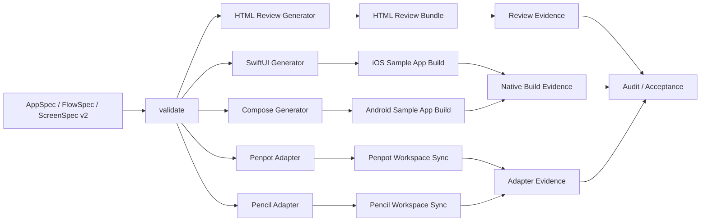

# 26. V2 System Design

## 1. Decision

v2는 현재 저장소의 **contract-first / deterministic / HTML canonical review** 원칙을 유지하되,
single-screen compiler에서 **multi-app / multi-flow / richer registry / motion / sample-app build verification** 으로 확장한다.

v2의 authoritative source는 아래 여섯 계약으로 닫는다.

1. `AppSpec`
2. `FlowSpec`
3. `ScreenSpec v2`
4. `Component Registry v2`
5. `MotionSpec`
6. `Review Checklist`

Penpot과 Pencil은 optional adapter다.
SwiftUI / Compose / HTML / Penpot / Pencil은 모두 **같은 계약**에서 파생돼야 한다.
어떤 downstream artifact도 source of truth가 아니다.

## 2. What V1 Keeps

- CLI canonical, MCP thin adapter
- deterministic validation before generation
- HTML preview as canonical review path
- generated artifact disposable policy
- audit / governance / freshness verification
- native integration은 generated boundary를 통해 이뤄져야 한다는 규칙

## 3. V2 Expansion

### 3.1 V2.1
- multi-app
- multi-flow
- richer registry
- motion spec
- HTML canonical review 강화

### 3.2 V2.2
- Penpot plugin adapter
- Pencil sync adapter

### 3.3 V2.3
- SwiftUI / Compose native generator 확장
- real sample apps build path 추가

### 3.4 V2.4
- runtime smoke를 typecheck 중심에서 sample app build / test로 승격

## 4. Architecture



## 5. Layer Rules

### 5.1 Contract layer
- 사람이 고치는 곳이다.
- app / flow / screen / motion / review / registry 계약을 소유한다.
- free-form HTML, free-form SwiftUI, free-form Compose를 직접 소유하지 않는다.

### 5.2 Review layer
- HTML이 canonical review surface다.
- review state, motion intent, CTA emphasis, layout hierarchy를 가장 먼저 검토한다.
- visual benchmark는 reference input이지 source가 아니다.

### 5.3 Adapter layer
- Penpot / Pencil은 review / collaboration / downstream handoff adapter다.
- contract를 바꾸지 못한다.
- adapter drift는 audit 대상이다.

### 5.4 Native layer
- SwiftUI / Compose는 같은 screen contract를 다른 renderer로 푼 결과다.
- native output은 sample app build에서 실제로 compile / build / test 돼야 한다.

## 6. Repo Additions

v2는 현재 저장소에 아래 구조를 추가한다.

```text
docs/
  26-v2-system-design.md
  27-v2-doc-structure.md
  28-v2-schema-drafts.md
  29-v2-private-shadcn-registry.md
  30-v2-operating-runbook.md

schemas/
  v2/
    app-spec.schema.json
    flow-spec.schema.json
    screen-spec-v2.schema.json
    component-registry-v2.schema.json
    motion-spec.schema.json
    review-checklist.schema.json

examples/
  v2/
    apps/
    flows/
    screens/
    motion/
    review/

registries/
  shadcn/
    registry.json
    items/
```

## 7. Non-Negotiable Rules

1. source of truth는 contract set 하나로 유지한다.
2. HTML -> Penpot/Pencil -> Native 재해석 경로를 canonical path로 쓰지 않는다.
3. arbitrary Tailwind class 생성과 arbitrary component import를 금지한다.
4. native generation은 review-approved contract에서만 진행한다.
5. sample-app build evidence 없이는 “integration complete”를 주장하지 않는다.

## 8. Final Success Condition

v2 완료는 아래가 모두 참일 때만 인정한다.

- 두 개 이상 앱이 같은 contract stack을 공유한다.
- 한 앱당 두 개 이상 flow가 sample app build까지 닫힌다.
- richer registry + motion contract가 HTML / SwiftUI / Compose에서 같은 의미를 유지한다.
- Penpot / Pencil adapter가 source-owned contract와 drift 없이 동작한다.
- acceptance는 HTML review evidence와 sample app build evidence를 함께 가진다.
